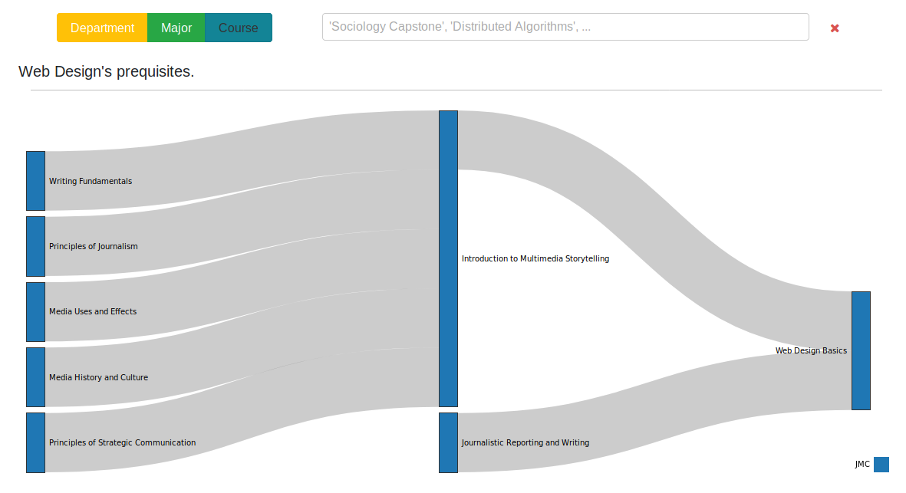

# Higher Knowledge Graph

<p align="center">
	
</p>

### About


**Used Packages:**
- [D3.js](https://github.com/d3/d3) for the visualization.
- [Sigma.js](https://github.com/jacomyal/sigma.js/) for the graph manipulation.
- [Lodash](https://github.com/lodash/lodash) for synatatic sugar while manipulating data.
- [React](https://reactjs.org/) and [React-Faux-DOM](https://github.com/Olical/react-faux-dom) for the user interface.
- [Bootstrap v4.0](https://getbootstrap.com) and [React-fa](https://github.com/andreypopp/react-fa) for formatting and icons, respectively. 

### Data

Forewarning; All of the data in the application *has been scraped*. Because the University of Iowa didn't respond favorably to my data requests, I scraped the best I could using Python and Scrapy. You can see the work in the related [data repo](https://github.com/ryan-p-larson/hackathon).

**Courses**:
```
"CS:3330": {
    "courseID": "CS:3330",
    "description": "Topics include algorithm design techniques (divide and conquer, dynamic programming, greedy) and analysis techniques (big-0 notation, recurrence), ...",
    "hours": 3.0,
    "href": "https://myui.uiowa.edu/my-ui/courses/details.page?_ticket=sh8ztCbNgevl28i9m-qu6C_NcRa8iJ4V&id=835263&ci=158661",
    "name": "Algorithms",
    "department": "CS",
    "course_num": 3330,
    "before": [
      {
        "source": "CS:2210",
        "target": "CS:3330"
      },
      ...
    ],
    "after": []
  }
  ```

**Departments**:

| label | value |
|---|---|
| Study Abroad (214) | ABRD |
| Anatomy and Cell Biology (6) | ACB |
| ... | ... |

**Majors**
```
"computer-science-ba": {
    "major": "computer-science-ba",
    "alias": "Computer Science BA",
    "courses": [
      {
        "year": 1,
        "semester": 1,
        "courseID": "MATH:1005"
      },
      {
        "year": 1,
        "semester": 1,
        "courseID": "RHET:1030"
      },
      {
        "year": 1,
        "semester": 1,
        "courseID": "CSI:1600"
      },
      {
        "year": 1,
        "semester": 2,
        "courseID": "CS:1110"
      },
      ...
    ]
  }
```

### Installation

**Prerequisites**: You will need Node and NPM installed to run the website.

1. Clone this repository: `git clone https://github.com/ryan-p-larson/higher-knowledge-graph.git`
2. Change directory to the new folder: `cd higher-knowledge-graph` 
3. Install the neccesary packages: `npm install`
4. Run the server: `npm start`

### Inspiration

Like everything else, this [is a remix.](http://www.everythingisaremix.info/) I'd like to principally thank Nick Balestra for his [React Sankey app](https://github.com/nickbalestra/sankey), his work served as a foundation for this project. In addition I drew from the following sources:
- [Existing.](media/pacific-university-mathematics-chart.JPG) [College.](media/cornell-university-compsci-chart.JPG) [Course.](media/georgefox-engineering-chart.JPG) [Charts.](media/nmt-compsci-chart.JPG)
- [Semnatic Networks](https://en.wikipedia.org/wiki/Semantic_network)
- [Directed Graphs, from Princeton](http://algs4.cs.princeton.edu/42digraph/)
- [Graph Traversals](https://en.wikipedia.org/wiki/Graph_traversal)
